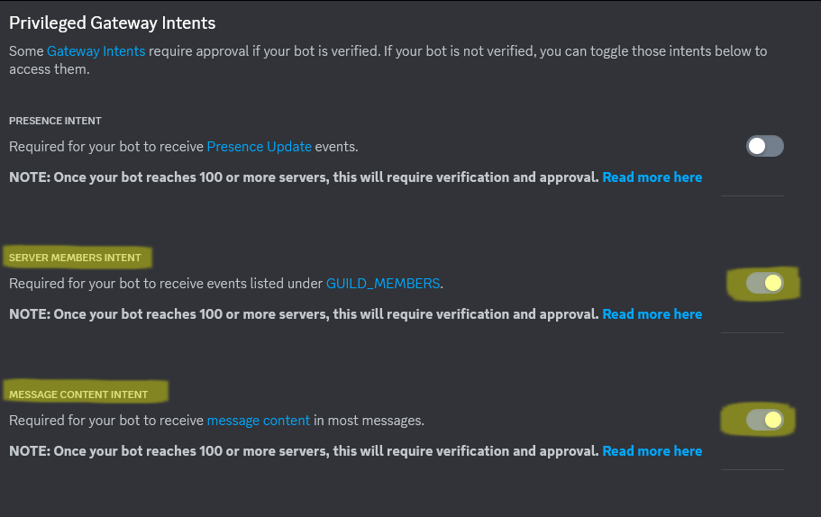
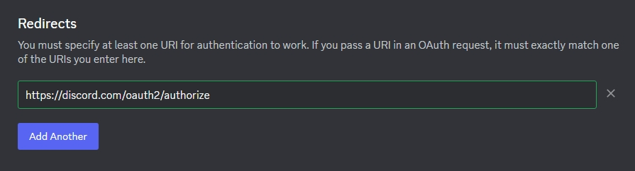
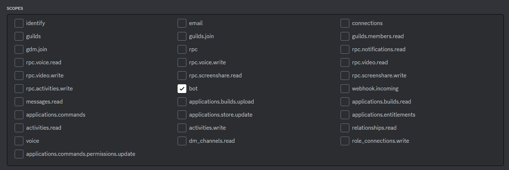
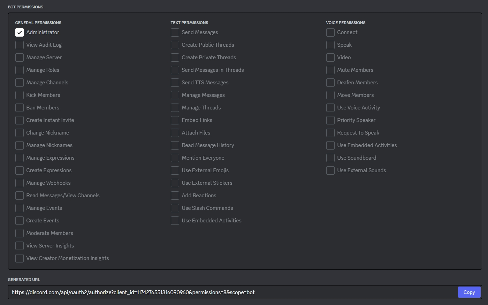
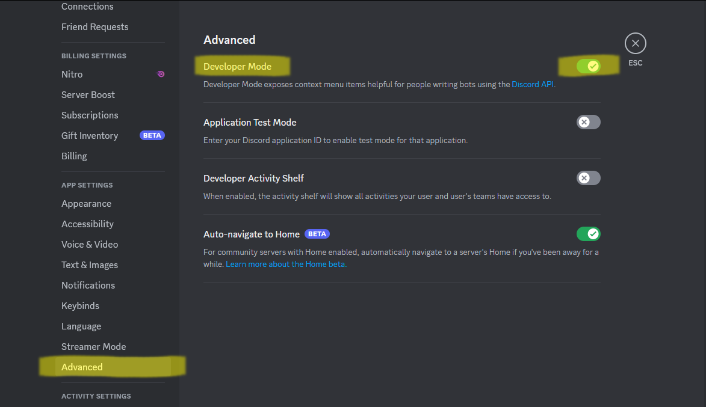
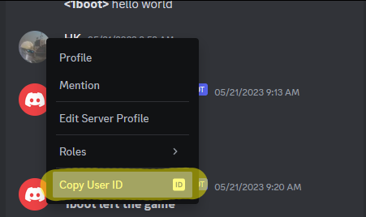

This tutorial is divided into two parts, `Discord Server` and `Minecraft Server`. These two parts need to be set up separately, and if you are familiar with how to create a DC Bot, then you can just focus on the configuration of the MC Server part.

# 1 Discord Server

This project will eventually require the deployment of a bot to your DC server. Bots are part of an app. You first create an application as a container and foundation, and then create a bot user inside that application to implement various automated functions.

**Except for step `1.2.2` and `1.3.5` below, which are specific to this bot,** the other steps are for a general purpose - <u>to create a self-used Discord Bot, provide a token, and add it to the Discord Server</u>. **You can ask GPT or other tutorials based on this sentence to determine the details. This tutorial is just to provide a step-by-step reference.**

## 1.1 Create Application

1. **Go to** [Discord Developer Portal](https://discord.com/developers/applications) and login (recommend to use the admin account of the DC Server you want to integrate with).
2. **Click** on `New Application` button in the top right `↗` corner, give it a name to start creating.
3. Now you've created the app and entered its settings panel.

## 1.2 Set Bot

1. In the application setting panel, **click** `Bot` on the left side menu bar to go to the bot panel.

2. Under the heading `Privileged Gateway Intents`, **enable** `SERVER MEMBERS INTENT` and `MESSAGE CONTENT INTENT`. Refer to the image:

   

3. Under the upward heading `Build-A-Bot`, **click** `Reset Token`. **Copy and keep** this token in a safe place, and if you lose it, you need to generate a new one. **This token is the credential for the MC Server to connect to the Bot.**

## 1.3 Add Bot to Discord Server

1. **Click** `OAuth2` > `General` on the left side menu bar to go to the OAuth2 panel.

2. Under the heading `Redirects`, **click** button `Add Redirect`, **paste** this URL in the newly appearing input box:
   ```text
   https://discord.com/oauth2/authorize
   ```

   Refer to the image:

   

   The technical explanation here can be referred to the official documentation: [Discord Developer Docs > OAuth2](https://discord.com/developers/docs/topics/oauth2).

3. **Click** `OAuth2` > `URL Generator` on the left side menu bar to go to the OAuth2 panel.

4. **Select** `bot` in the `SCOPES` check list. Refer to the image:

   

5. **Select** `Administrator` in the `BOT PERMISSIONS` check list (this is just a recommendation, and you may be able to adjust it according to your actual needs). Refer to the image:

   

   **Copy and save** the`GENERATED URL` below.

6. **Open** the URL in your browser and select the server you want to add the bot to.

# 2 Minecraft Server

## 2.1 Add Mod to Server

1. Find the version you need and **download** to your server's `mods` folder [here](https://github.com/chunkaligned/fabric-discord-integration/releases).
2. **Launch** the server to initialize this mod, and then **shut down** the server.

## 2.2 Mod Configuration

After initialization, you can **configure** `config/discord.json`, the initial state looks like this:

```json
{
  "token": "YOUR-TOKEN-HERE",
  "commandPrefix": "mc!",
  "relayChannelIDs": [],
  "rconUserIDs": [],
  "disableMentions": true,
  "discordMessageFormat": "[$NAME] $MESSAGE",
  "chatMessageFormat": "**\u003c$NAME\u003e** $MESSAGE",
  "systemMessageFormat": "**$MESSAGE**"
}
```

In this file, `token`, `relayChannelIDs`, and `rconUserIDs` are the ones that must be modified. The specific explanation is:

1. `token`: The token obtained when creating a DC bot in `1.2.3` above.

2. `relayChannelIDs`: In Discord, copy the URL link of the channel you want this bot to be active on. The URL will looks like:

   ```text
   https://discord.com/channels/<server_ID>/<channel_ID>
   ```

   The `<channel_ID>` here is what you need. You can add multiple channels to the configuration file separated by commas.

3. `rconUserIDs`: You can add multiple users to the configuration file separated by commas. To find someone's user ID, you need to enable `Developer Mode` on your Discord client:

    

    Then you can right-click the user and click `Copy User ID` to get it:

    

